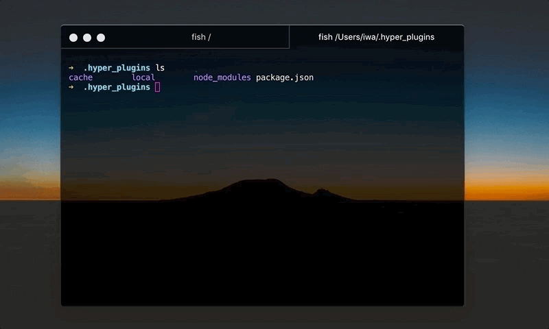

# hyper-monokai-glow

[](https://www.npmjs.org/package/hyper-monokai-glow)

Monokai theme to the Hyper terminal



## Install

add it to plugins in your `~/.hyper.js` configuration

```js
module.exports = {
  ...
  plugins: ['hyper-monokai-glow']
  ...
}
```
